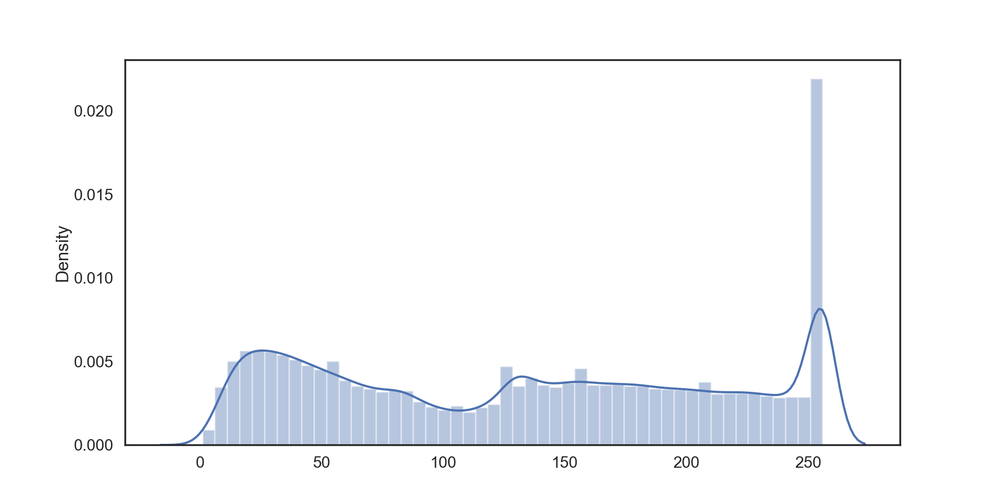

# mrc_qa_gen

在 [bert4keras](https://github.com/bojone/bert4keras) 基础上，使用pytorch实现基于UniLM+BERT进行seq2seq生成式中文机器阅读理解

## 环境

同 [mrc_qa](../README.md) 的环境配置。

## 数据集

融合了WebQA、ChineseSquad、Sogou QA、军事QA、Dureader、CMRC2018、法研杯CAIL、疫情问答、DRCD，经过预处理为统一格式，针对片段裁剪后形成的数据集，保存在 `./dataset/train_trunc.json`。

裁剪：将数据集中context裁剪为最大长度256，以答案起始位置为中心，前后各取128位，向内取最小完整句子。

数据集分布：共546946条数据，context分布如下图所示



运行时自动以9：1随机划分训练集和验证/测试集，不需要手动划分。数据集下载: https://drive.google.com/file/d/1goTMhD6eo9Nl2MO5ea1ApBpTusG2FtDJ/view?usp=sharing

## 预训练模型

https://github.com/ymcui/Chinese-BERT-wwm 哈工大讯飞联合实验室发布的基于全词掩码技术的中文预训练模型。下载Pytorch版本的模型（[GDrive](https://drive.google.com/open?id=1iNeYFhCBJWeUsIlnW_2K6SMwXkM4gLb_)或[Huggingface](https://huggingface.co/hfl/chinese-bert-wwm-ext)）到 `./pretrained_model/` 目录。

## 训练与验证

```sh
python train_eval.py
```

运行时会在屏幕打印当前进度，详细info记录在 `./log/gen_run.log` 中，实时查看：

```sh
tail -f ./log/gen_run.log
```

每个epoch结束会使用验证集的1000条进行小规模验证，自动在 `./finetuned_model/` 保存表现最好的模型，并在 `./log/` 下生成验证结果：`P_s2s_pred_answer_{enum}.json`。

## 测试

```sh
python evaluation.py
```

运行测试对模型使用划分的全量测试集进行测试，在 `./log/full_test.json` 生成测试结果，使用的评测指标为 BLEU, ROUGE-1, ROUGE-2和ROUGE-L。

## 结果

在54695条的测试集上的评估结果：

| ROUGE-1            | ROUGE-2            | ROUGE-L            | BLEU               |
| ------------------ | ------------------ | ------------------ | ------------------ |
| 0.8557206437783306 | 0.4693703067601237 | 0.8553490709969978 | 0.6440044807952671 |

## 说明

```
gen
├── README.md				# 说明文件
├── bojone_snippets.py		# DataGenerator载入数据的基类和通用自回归生成模型解码基类实现
├── bojone_tokenizers.py	# 分词器基类实现
├── chinese-bert-wwm-ext	# 存放使用的预训练模型：BERT-wwm-ext
├── config.py				# 参数和配置文件
├── dataset					# 存放上面提到的数据集
├── evaluation.py			# 测试代码
├── finetuned_model			# 训练后的模型保存在这里
├── log						# 运行过程中的日志和测试结果
├── model_unilm.py			# 基于BERT使用mask的UniLM实现
├── modeling_bert.py		# BERT预训练模型的pytorch实现
├── optimizer.py			# 创建optimizer和scheduler的方法
├── rc.py					# 生成式mrc统一类实现
├── train_eval.py			# 训练和验证代码
└── utils.py				# 辅助函数，划分数据集
```

